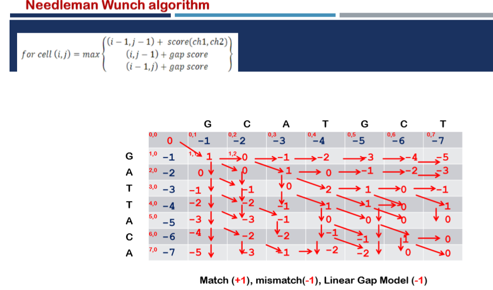
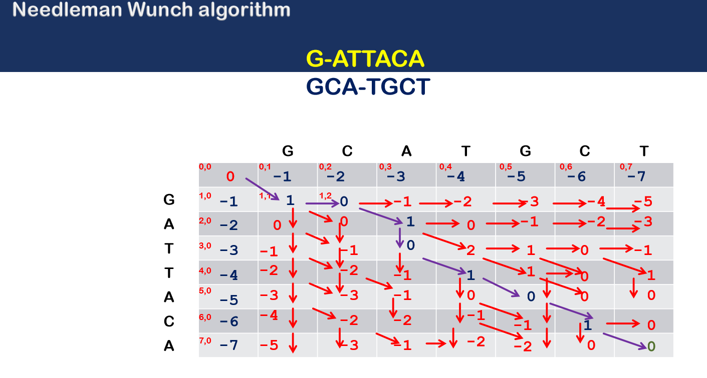

# sequence alignment
One of the most problems that a DNA sequence changes, most frequently due to random errors in replication (or the copying of a DNA sequence) which causes mutations(substitutions,insertions and deletions) .
by using **Pairwise sequence alignment** methods to find the best-matching piecewise (local or global) alignments of two query sequences. Pairwise alignments can only be used between two sequences with high similarity by aligning the sequences to one another inserting gaps.

---
<br />

## Needleman-Wunsch
which performs Global sequence alignment.
It was designed to compare biological sequences and was one of the first applications of dynamic programming to the biological sequence comparison

---
<br />


``` python
def matrix_score(self):
        x=0
        m,n=len(seq1),len(seq2)
        matrix_score=np.zeros((m+1,n+1),dtype=int)
        for i in range(0,m+1):
            matrix_score[i][0]=gap*i
        for j in range(0,n+1):
            matrix_score[0][j]=gap*j

        for i in range(1,m+1):
            for j in range(1,n+1):
                diagonal=matrix_score[i-1][j-1]+match_score(seq1[i-1],seq2[j-1])
                up=matrix_score[i-1][j]+gap
                left=matrix_score[i][j-1]+gap
                matrix_score[i][j]=max(diagonal,up,left)
        return matrix_score 
```

<br />

### Step1: 
create a 2D matrix that has in the frist raw and column our sequence
seconed raw and column  has the score of each char which calclate as gap_score*char_position 
the rest of matrix is calculated by comparing the scores of the cells neighboring to the left, top or top-left (diagonal) and choosing tha maximum value

<br />



---
<br />

``` python
def trace_back(self,matrix_score):
        align1,align2='',''
        i,j=len(seq1),len(seq2)

        while i>0 or j>0:
            score_current=matrix_score[i][j]
            score_diagonal=matrix_score[i-1][j-1]
            score_left=matrix_score[i][j-1]
            score_up=matrix_score[i-1][j]

            if score_current==score_diagonal+match_score(seq1[i-1],seq2[j-1]):
                a1,a2=seq1[i-1],seq2[j-1]
                i,j=i-1,j-1
            elif score_current==score_up+gap:
                a1,a2=seq1[i-1],"-"
                i-=1
            elif score_current==score_left+gap:
                a1,a2="-",seq2[j-1]
                j-=1

            align1+=a1
            align2+=a2
        align1=align1[::-1]
        align2=align2[::-1]
        return align1,align2
```

<br />

### Step2: 
from the cell on the bottom right back to the cell on the top left (diognal path) we will find the best match by  diagonal arrow represents a match or mismatch, so the letter of the column and the letter of the row of the origin cell will align.
A horizontal or vertical arrow represents an indel. Horizontal arrows will align a gap ("-") to the letter of the row (the "side" sequence), vertical arrows will align a gap to the letter of the column (the "top" sequence).
If there are multiple arrows to choose from, they represent a branching of the alignments. If two or more branches all belong to paths from the bottom right to the top left cell, they are equally viable alignments. In this case, note the paths as separate alignment candidates.

<br />


