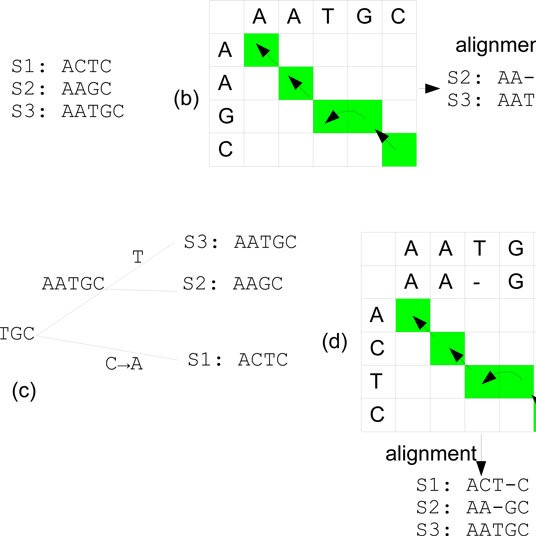
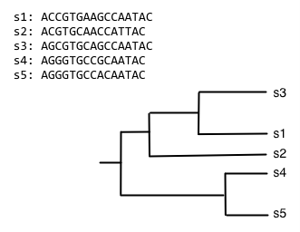
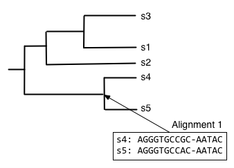
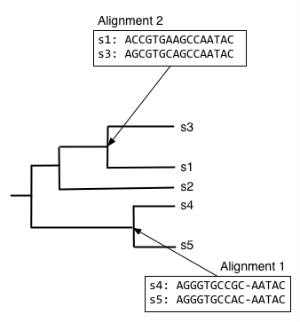
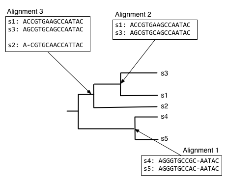
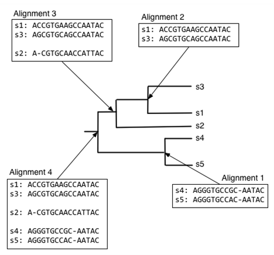

# Multiple Alignment Sequencing:

We used it when we need to make sequencing to many sequences (more than two) at the same time.
 
The alignment of three or more biological sequences (protein or nucleic acid) of similar length. From the output, homology can be inferred and the evolutionary relationships between the sequences studied.
 
Multiple sequence alignment is used to study closely related genes or proteins in order to find the evolutionary relationships between genes and to identify shared patterns among functionally or structurally related genes.

---
 

## Progressive alignment:

is a heuristic for multiple sequence alignment that does not optimize any obvious alignment score. The idea is to do a succession of pairwise alignments, starting with the most similar pairs of sequences and proceeding to less similar ones.

 

In progressive alignment, the problem of exponential growth of runtime and space is managed by selectively aligning pairs of sequences, and aligning alignments of sequences. What we typically do is identify a pair of closely related sequences, and align those. Then, we identify the next most closely related sequence to that initial pair, and align that sequence to the alignment. This concept of aligning a sequence to an alignment is new, and we'll come back to it in just a few minutes. The other concept of identifying the most closely related sequences, and then the next most closely related sequence, and so on should sound familiar. It effectively means that we're traversing a tree. And herein lies our problem: we need a tree to efficiently align multiple sequences, but we need an alignment to build a good tree.

 

You probably have two burning questions in your mind right now:

- How do we build a tree to guide the alignment process, if we need an alignment to build a good tree?
- How do we align a sequence to an alignment, or an alignment to an alignment?

 

The process of progressive multiple sequence alignment could look like the following. First, we start with some sequences and a tree representing the relationship between those sequences. We'll call this our guide tree, because it's going to guide us through the process of multiple sequence alignment. In progressive multiple sequence alignment, we build a multiple sequence alignment for each internal node of the tree, where the alignment at a given internal node contains all of the sequences in the clade defined by that node.

Starting from the root node, descend the bottom branch of the tree until you get to the an internal node. If an alignment hasn't been constructed for that node yet, continue descending the tree until to get to a pair of nodes. In this case, we follow the two branches to the tips. We then align the sequences at that pair of tips (usually with Needleman-Wunsch, for multiple sequence alignment), and assign that alignment to the node connecting those tips.

Next, we want to find what to align the resulting alignment to, so start from the root node and descend the top branch of the tree. When you get to the next node, determine if an alignment has already been created for that node. If not, our job is to build that alignment so we have something to align against. In this case, that means that we need to align `s1`, `s2`, and `s3`. We can achieve this by aligning `s1` and `s3` first, to get the alignment at the internal node connecting them.

We can next align the alignment of `s1` and `s3` with `s2`, to get the alignment at the internal node connecting those clades.

And finally, we can compute the alignment at the root node of the tree, by aligning the alignment of `s1`, `s2`, and `s3` with the alignment of `s4` and `s5`.

 

***The alignment at the root node is our multiple sequence alignment.***

 
---
 

## Iterative alignment:
In an iterative alignment, the output tree from the above progressive alignment is used as a guide tree, and the full process repeated. This is performed to reduce errors that result from a low-quality guide tree.

